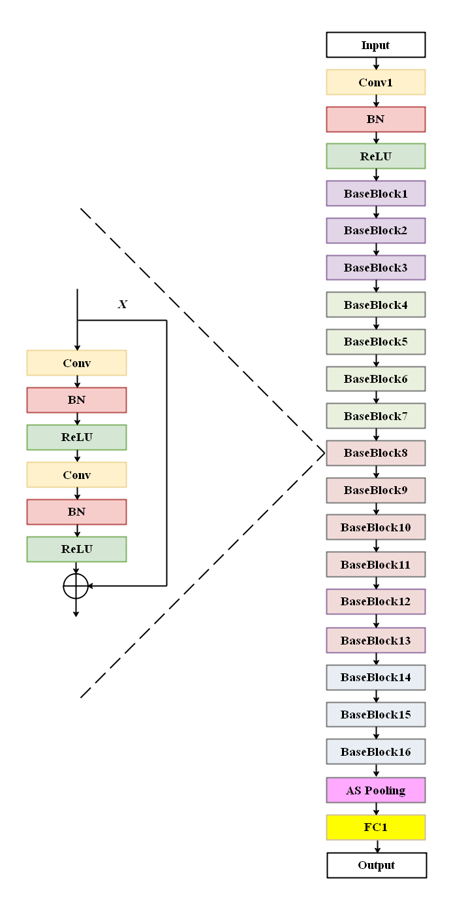

 

<!-- PROJECT LOGO -->
<br />

<p align="center">
  <a href="https://github.com/kabrate/ASV">
    
  </a>
  <h3 align="center">Automatic Speaker Recognition</h3>
  <p align="center">
    Small footprint Automatic Speaker Recognition (ASV)
  </p>

</p>

> tags : automatic speaker recognition, asv, ResNet, deep learning, pytorch

## About The Project

Speaker recognition is the identification of a person from characteristics of voices. It is used to answer the question "Who is speaking?" The term voice recognition can refer to speaker recognition or speech recognition. Speaker verification (also called speaker authentication) contrasts with identification, and speaker recognition differs from speaker diarisation (recognizing when the same speaker is speaking).

Recognizing the speaker can simplify the task of translating speech in systems that have been trained on specific voices or it can be used to authenticate or verify the identity of a speaker as part of a security process. 


### Built With
This project was built with 

* python v3.7
* pytorch v1.11
* The list of libraries used for developing this project is available at [requirements.txt](torch_speaker/requirements.txt).

## Getting Started

Clone the repository into a local machine and enter the [torch_speaker](torch_speaker) directory using

```shell
git clone https://github.com/kabrate/ASV
cd torch_speaker_recognization/torch_speaker
pip install -r requirements.txt
```

## Model overview
The ASV system developed has the following architecture.


## Experiments

**stage 1:** data preparation

```bash
rm -rf data; mkdir data
wget -P data/ https://www.robots.ox.ac.uk/~vgg/data/voxceleb/meta/veri_test.txt
echo format trails
python3 scripts/format_trials.py \
			--voxceleb1_root $voxceleb1_path \
			--src_trials_path data/veri_test.txt \
			--dst_trials_path data/vox1.txt
```

**stage 2:** ASV model evaluation in raw audio

```bash
python3 tools/evaluate.py \
			--config config/voting.yaml \
			--trial_path data/vox1.txt \
			--checkpoint_path $checkpoint_path
```


